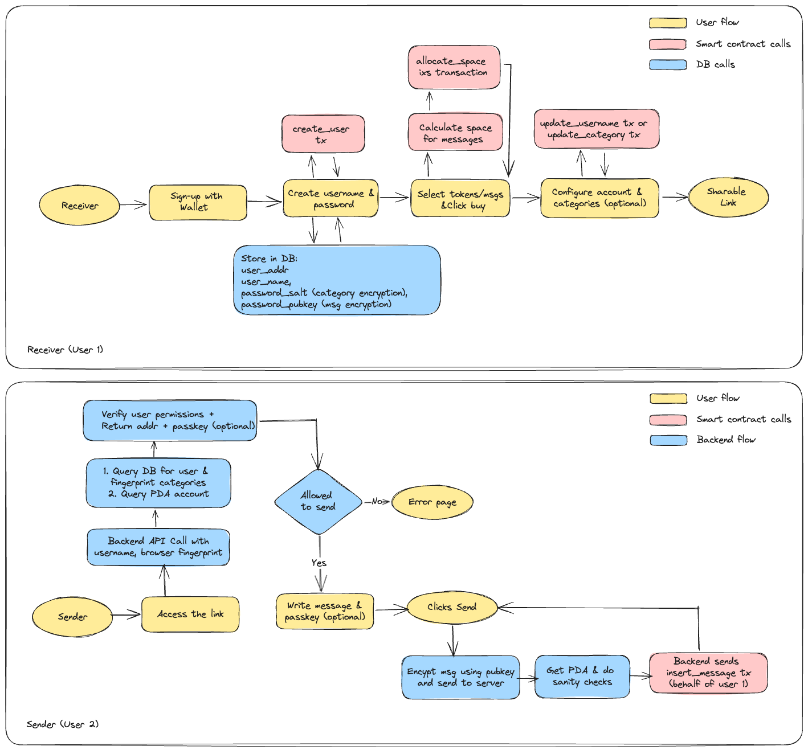

# Decentralized AI System for Private Code Zero-Knowledge Compression

This incorporates Zero Knowledge Compression and proofs into the decentralized and private AI using Solana smart contracts, Content Identifiers (CIDs) for on-chain models, and secure it with Privy. Here's a comprehensive redesign that combines the zero-knowledge concepts with blockchain technology.

<figure><figcaption></figcaption></figure>

### 1. Core Architecture Overview

The redesigned system leverages Solana's high-performance blockchain to create a decentralized AI framework with strong privacy guarantees through:

* Zero-knowledge proofs for privacy-preserving code transformations
* On-chain AI models referenced via Content Identifiers (CIDs)
* Privy for secure identity management and access control
* Solana smart contracts for trustless execution and verification

### 2. System Components

#### 2.1 Decentralized Infrastructure Layer

* **Solana Blockchain**
  * High-throughput blockchain for transaction processing
  * Secure program execution environment for AI-related smart contracts
  * On-chain storage of model references and proof verifications
* **Decentralized Storage**
  * IPFS/Arweave integration for storing:
    * Compressed model weights referenced by CIDs
    * Zero-knowledge proof verification keys
    * Metadata about transformations (without exposing actual code)

#### 2.2 Privacy Framework

* **Privy Integration**
  * Decentralized identity management
  * Secure key storage and management
  * Granular permissions for data access
  * Zero-knowledge authentication flows
* **Zero-Knowledge Pipeline**
  * zk-SNARKs/zk-STARKs circuits for code transformation verification
  * Recursive proof composition for complex multi-step transformations
  * Privacy-preserving state transitions on Solana

#### 2.3 AI Components

* **On-Chain AI Registry**
  * Smart contracts managing pointers to AI models (stored as CIDs)
  * Versioning system for model updates
  * Reputation and quality metrics for models
* **Permissioned Training Environment**
  * Federated learning protocols with differential privacy
  * Multi-party computation for collaborative model improvements
  * Zero-knowledge proofs verifying model training integrity

### 3. User Flow Diagrams

#### 3.1 Receiver (User 1) Flow

The user flow remains similar to the original diagram but with these additions:

1. **Initial Authentication**
   * Privy wallet integration for decentralized identity
   * Zero-knowledge verification of user credentials
2. **Smart Contract Integration**
   * Transaction records on Solana for all user actions
   * Escrow mechanisms for token-based services
3. **Data Privacy**
   * All user data encrypted using threshold cryptography
   * Only zk-proven computation results shared on-chain

#### 3.2 Sender (User 2) Flow

The sender flow incorporates:

1. **Decentralized Access Control**
   * Permission verification via Solana programs
   * Zero-knowledge proofs for access rights
2. **On-Chain Message Verification**
   * Message integrity proven through zk-circuits
   * CID references for message content

### 4. Technical Implementation

#### 4.1 Solana Smart Contract System

```rust
// Simplified Solana program for AI model registry and access control
#[program]
pub mod ai_registry {
    use super::*;
    
    // Register a new AI model with CID reference
    pub fn register_model(ctx: Context<RegisterModel>, model_cid: String, 
                         proof_cid: String, metadata: ModelMetadata) -> Result<()> {
        // Verification logic for model authenticity
        // Store CID reference on-chain
    }
    
    // Request code transformation with privacy guarantees
    pub fn request_transformation(ctx: Context<RequestTransformation>, 
                                 input_hash: [u8; 32], parameters: TransformationParams) -> Result<()> {
        // Create transformation job
        // Initialize escrow for payment
    }
    
    // Submit transformation result with zero-knowledge proof
    pub fn submit_transformation_result(ctx: Context<SubmitResult>, 
                                      output_cid: String, zk_proof: ZkProof) -> Result<()> {
        // Verify zero-knowledge proof on-chain
        // Release payment from escrow upon successful verification
    }
}
```

#### 4.2 Zero-Knowledge Circuit Design

```
// Pseudocode for zero-knowledge circuit proving code transformation correctness
function build_transformation_circuit(original_code_hash, transformed_code_hash, transform_type) {
    // Define witnesses (private inputs)
    private original_code;
    private transformed_code;
    
    // Public inputs
    public original_hash = hash(original_code);
    public transformed_hash = hash(transformed_code);
    public transform_parameters;
    
    // Constraints
    assert(hash(original_code) == original_code_hash);
    assert(hash(transformed_code) == transformed_code_hash);
    
    // Verify the transformation is correct
    // This depends on the type of transformation (compression, refactoring, etc.)
    assert(verify_transformation(original_code, transformed_code, transform_type));
    
    // Verify semantic equivalence (if required)
    for test_case in test_cases {
        assert(execute(original_code, test_case) == execute(transformed_code, test_case));
    }
}
```

#### 4.3 Privy Integration for Secure Identity

```javascript
// Frontend pseudocode for Privy integration
async function authenticateUser() {
    // Initialize Privy with Solana wallet support
    const privy = new PrivyClient({
        supportedChains: ['solana'],
        appId: 'your-app-id'
    });
    
    // Authenticate user with wallet
    const user = await privy.authenticate({
        loginMethods: ['wallet'],
        embeddedWallets: {
            createOnLogin: true
        }
    });
    
    // Generate zero-knowledge proof of identity without revealing private keys
    const zkIdentityProof = await privy.createZkProof({
        claim: 'user-authentication',
        subject: user.id
    });
    
    return { user, zkIdentityProof };
}
```

### 5. Decentralized AI Workflow

1. **Model Publishing**
   * AI models are trained with privacy-preserving techniques
   * Model weights compressed and stored on IPFS/Arweave with CID references
   * Model metadata and CIDs registered on Solana blockchain
2. **Code Transformation Request**
   * User submits code transformation request (hash only) to Solana program
   * Smart contract escrows payment and creates job listing
3. **Privacy-Preserving Execution**
   * AI providers fetch job details and process locally or in MPC environment
   * Generate zero-knowledge proof of correct transformation
   * Submit transformed code hash and proof to blockchain
4. **Verification and Settlement**
   * Solana program verifies zero-knowledge proof on-chain
   * Upon successful verification, payment released from escrow
   * User receives transformed code with privacy guarantees

### 6. Security and Privacy Features

* **User Privacy**
  * Privy ensures secure key management and authentication
  * Zero-knowledge proofs verify computation correctness without revealing code
  * Data minimization through hash references on-chain
* **Trustless Verification**
  * All transformations verified through cryptographic proofs
  * No trusted parties required for computation integrity
  * Recursive proofs allow complex multi-step verification
* **Economic Security**
  * Token incentives for honest AI providers
  * Slashing mechanisms for malicious behavior
  * Reputation systems for model quality assessment

### 7. Advanced Features

* **Decentralized Governance**
  * DAO structure for managing system parameters
  * Community-driven model certification
  * Protocol upgrades through on-chain voting
* **Federated AI Improvement**
  * Secure multi-party computation for collaborative model training
  * Privacy-preserving model updates without data sharing
  * Incentives for contributing to model improvement
* **Cross-chain Interoperability**
  * Bridge contracts for multi-chain AI access
  * Unified identity across blockchains through Privy

This decentralized architecture preserves the core privacy benefits of the original zero-knowledge system while adding the transparency, security, and economic incentives of blockchain technology. The system achieves true decentralization while maintaining data privacy through cryptographic guarantees.
